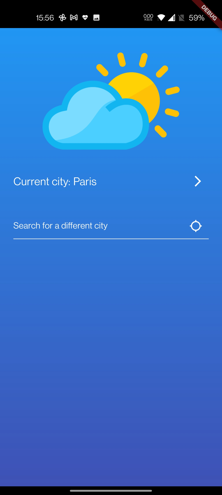
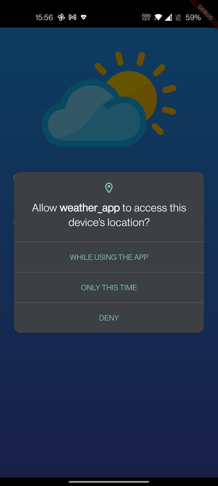
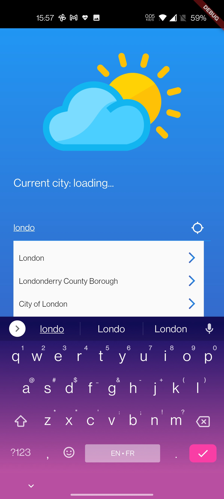
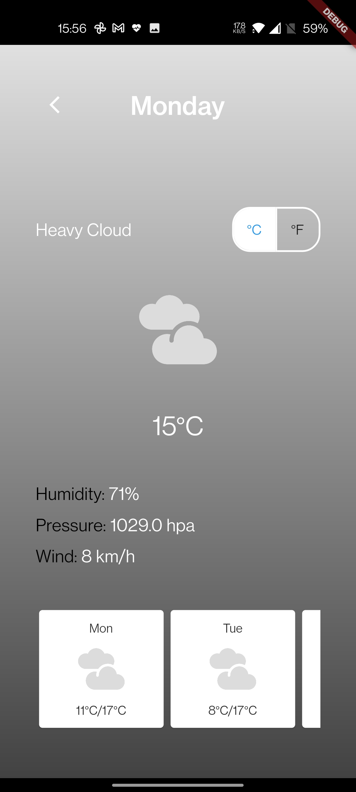
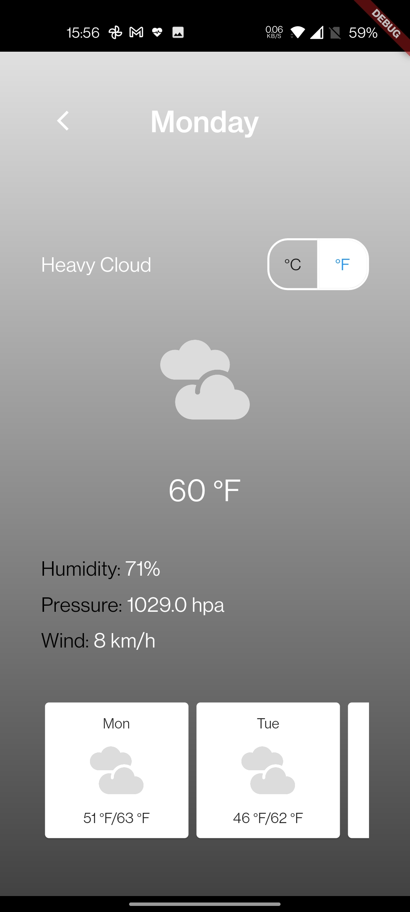
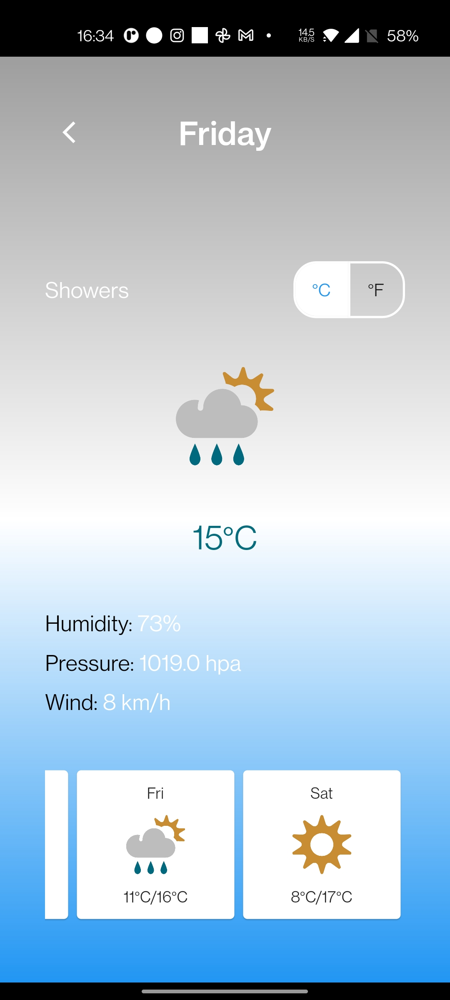
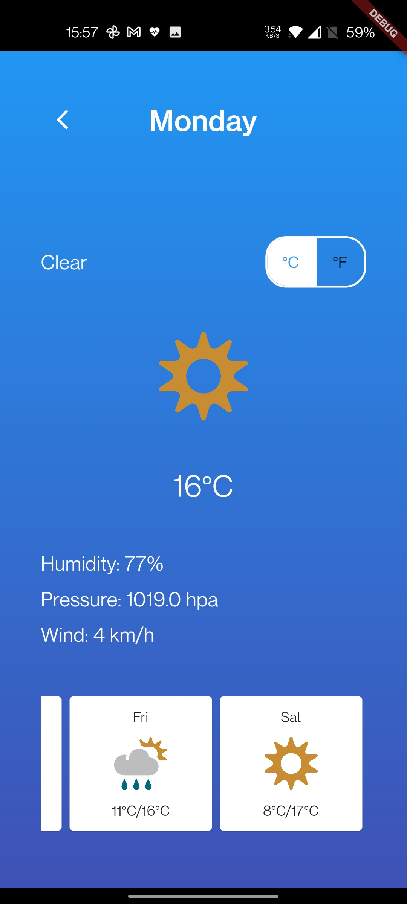
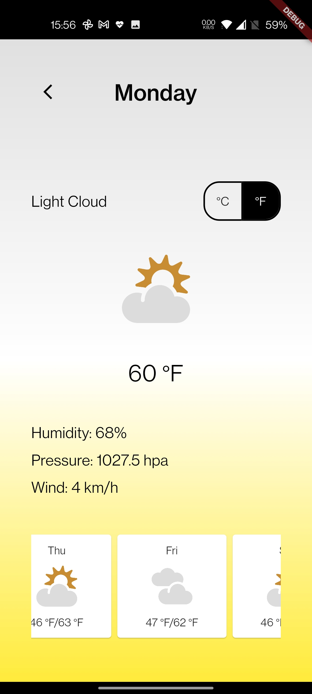
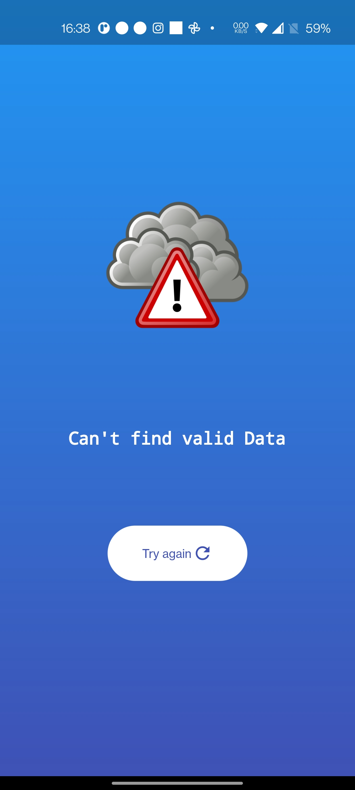

# weather_app

A weather demo app that displays weather information for a given city using the
[REST API](https://www.metaweather.com/api/).

## Demo

 

 [You can find a demo of the app video in here](https://youtu.be/jj5F4h0vtrs)

## Screenshots

Since the app uses location it asks for the users permission

The user can get the weather of he's current location or search for another location using an automplete field that is populated from an [online json](https://raw.githubusercontent.com/lutangar/cities.json/master/cities.json) containing the world cities.

And the result page changes depending of the weather status the user choice of degrees to show...

 

### Other screenshot

Flow screenshots

